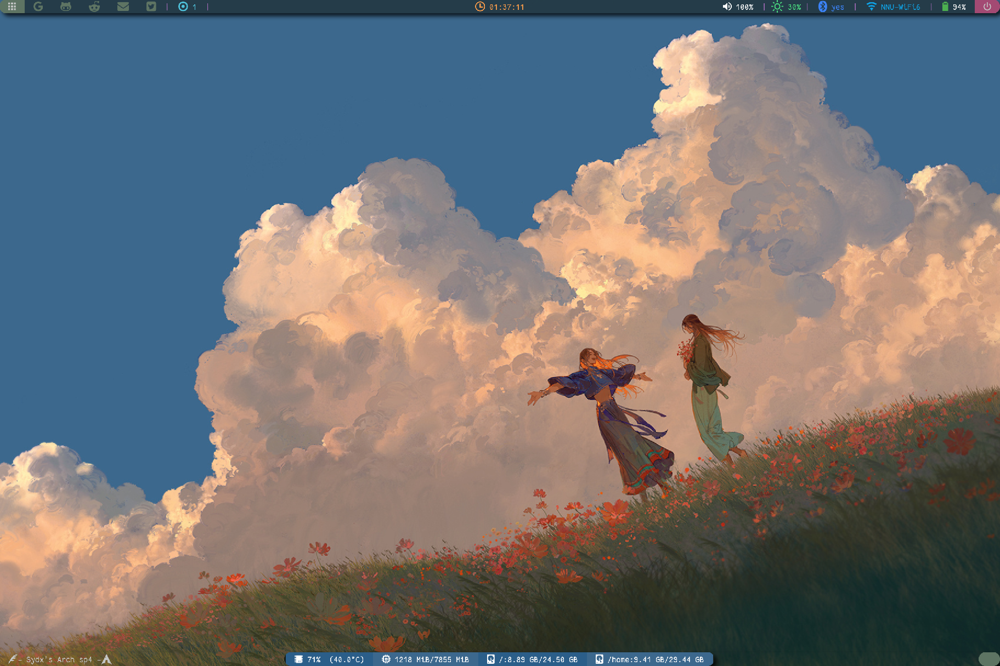
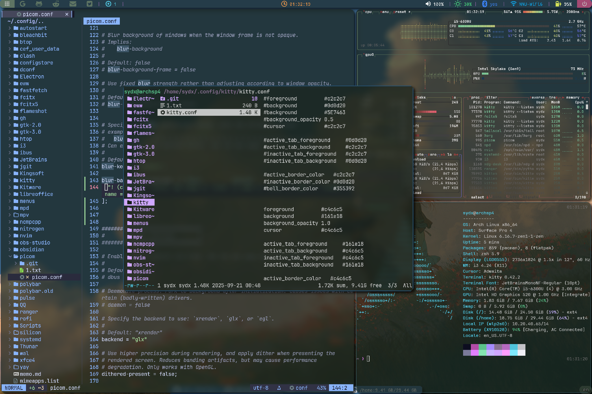
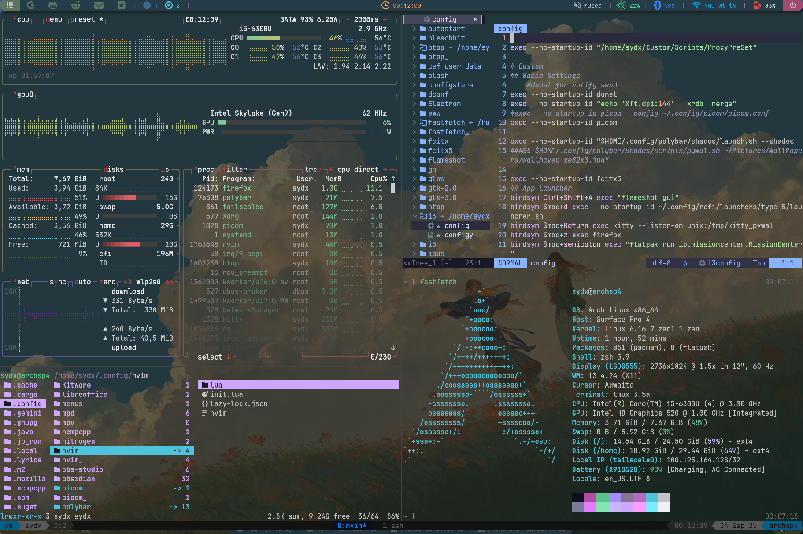

# 简介

**个人配置文件**

- 系统环境：archlinux
- 桌面环境：i3wm
- 桌面组件：polybar、rofi
- compositor：picom
- polybar、rofi、ranger、ohmyzsh所用具体插件自行查看
- home下的内容使用时自行改为dotfiles

## polybar

- 参考[polybar themes](https://github.com/adi1090x/polybar-themes)

## rofi

- 参考[rofi](https://github.com/adi1090x/rofi)
- 用到的其他相关repos
	1. [rofi-bluetoot](https://github.com/nickclyde/rofi-bluetooth)
	2. [rofi-wifi-menu](https://github.com/zbaylin/rofi-wifi-menu)

---

## Overview

- Desktop And WM

- WMs

- kitty, tmux, ranger, btop, nvim ...

- 不会给rofi截图

---

*纯小白，挺好玩*

